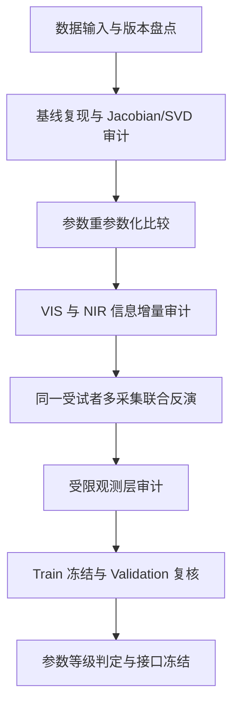

# KM-BIO-v3 参数可辨识性增强实施规划

> 版本：`KM-BIO-v3.0-plan`  
> 日期：2026-09-15  
> 状态：`REGISTERED_NOT_STARTED`  
> 适用项目：Face2 / Skin Optics / 阶段一 KM 半机制分支  
> 执行方式：按本文顺序逐项执行，完成一项后再进入下一项  
> 代码根目录：`E:/projects/face2`

## 0. 文档用途与定位

本文是 KM-BIO-v3 的独立实施规划，供后续编码、运行、审计和结果记录使用。它继承此前 `KM2L-HF-v2R`、`KM-BIO-v2R.1` 的有效公式、数据隔离和产物冻结规则，但不覆盖任何历史规划、实验记录、失败记录或冻结接口。

此前 KM-BIO-v2R.1 已完成阶段一光学层决策，最终状态为：

```text
V2R_SPECTRAL_ONLY
parameter_reliability_claim = none
reliable_parameter_list = []
theta_usable_as_supervised_target = false
km_bio_line_status = CLOSED_AT_STAGE1_DECISION
```

该结论必须保留。它说明现有双层 K–M 模型可以在一定程度上重建 Hyper-Skin 光谱，但在原参数化和原观测合同下，`f_mel`、`f_blood`、`s` 均不能作为可靠的逐例生理参数目标。

KM-BIO-v3 是阶段一光学层收尾之后新登记的参数可辨识性增强研究，不是把旧阶段一重新改判为通过，也不是用下游二分类结果反向证明光学参数。v3 的目标是回答：

> 在不新增采集、不使用 500 例心功能标签、不重新打开历史 Test 的条件下，现有 Hyper-Skin HSI 和现有双层 K–M 框架最多能够稳定支持几个有效生理光学参数？

如果 v3 最终仍不能得到可靠参数，也必须形成一个有证据的终止结论，并保留已经通过的 D2-MH proxy 分支作为后续路线。

## 1. v3 的核心目标

### 1.1 总目标

确定当前数据在双层 K–M 框架下可辨识的最大参数维度，并优先获得至少两个稳定的有效皮肤光学参数：

```text
M_eff：有效黑色素光学负荷
H_eff：等效总血红蛋白吸收负荷
```

`M_eff` 和 `H_eff` 是模型条件下的有效光学量，不得直接写成皮肤活检测得的黑色素含量、血液体积分数或临床血红蛋白浓度。

### 1.2 次级目标

在两个有效参数稳定后，依次评估：

1. 是否能够把 `H_eff` 拆分为 `H_oxy` 和 `H_deoxy`；
2. 是否能够从 `H_oxy/(H_oxy+H_deoxy)` 稳定派生氧合比例；
3. 是否有必要利用已有 NIR 波段增加散射和吸收的独立信息；
4. 是否能够利用同一受试者的多次采集，把生理参数与采集条件影响分开；
5. 是否需要加入低容量、受物理约束的尺度和光谱倾斜观测层。

这些目标按顺序执行。任何一步失败都不能通过直接增加下一步自由参数来绕过。

### 1.3 v3 不解决的问题

本文不承担以下任务：

- 不重新采集 Hyper-Skin 或其他真实 HSI；
- 不使用 500 例心功能数据训练、选择或调整光学模型；
- 不读取历史 Test 内容；
- 不把合成 K–M 光谱当作人体生理真值；
- 不把较低光谱 RMSE 自动等同于参数可靠；
- 不通过放宽参数边界、逐谱自由增益或高容量残差网络掩盖结构不可辨识；
- 不把 `s` 改名为 SpO₂，也不把 `H_eff` 改写成实验室 Hb 检测值；
- 不以 RGB 分类 AUC 作为任何光学参数通过门槛。

## 2. 历史基线与不可覆盖的结论

### 2.1 v2R.1 冻结基线

| 项目 | 冻结内容 |
|---|---|
| 模型 | 有限厚度表皮 + 半无限真皮双层 K–M |
| 主模型 | `KM2L-HF-v2R` / `V2R-PS` |
| 主参数 | `f_mel`、`f_blood`、`s` |
| 主波段 | 420–680 nm，10 nm 间隔 |
| Train | 44 名受试者、44 次 `neutral/front`、88 条左右脸颊谱；主分析聚合为 44 条双侧对称谱 |
| Validation | 3 人、18 次采集；仅作开发性复核 |
| Test | 4 人、24 次采集；v3 禁止读取内容 |
| 临床数据 | 500 例心功能人脸；v3 光学开发阶段禁止读取 |
| 固定量 | `g0=1.0`、`Dv=15 µm`、`s0=0.70`、表皮厚度 `0.060 mm`、`A_s=1.483456`、`Δb_s=0.500000` |
| 最终状态 | `V2R_SPECTRAL_ONLY`，三个生理参数全部 `unreliable` |

### 2.2 历史结果必须原样保留

v2R.1 的以下事实不能被 v3 改写：

- `V2R-PS` 的光谱重构相对固定参考谱有明显改善；
- `A_s` 和 `Δb_s` 的全局散射退化仍存在，`Δb_s` 达到登记上界；
- `f_mel`、`f_blood`、`s` 在 R-A 登记的包络规则下均为 `unreliable`；
- `s` 不输出；
- v2R.1 没有授权 Test、500 例临床数据、RGB 编码器训练或阶段二参数监督；
- D2-MH proxy 的阶段一 PASS 不等于 K–M 生理参数通过。

v3 的每个结果都必须与 v2R.1 的冻结基线并列报告，不能只报告改进后的候选模型。

## 3. 总体执行路线



每个阶段必须生成机器可读结果、Markdown 报告、输入与代码哈希、数据访问日志和明确的下一步授权状态。任何阶段出现未登记的输入、自由度或阈值变化，必须停止并升级版本。

## 4. 数据输入合同

### 4.1 数据角色

| 数据 | v3 允许用途 | v3 禁止用途 |
|---|---|---|
| 历史 Train 44 人 | 全部 v3 开发、结构审计、参数比较、受试者级交叉验证和 Train 冻结 | 不称为 44 个独立采集；同一人的 6 次采集不得当作独立受试者 |
| Train 的 6 类已有采集 | 多采集联合反演和采集条件压力分析；标签必须从 manifest 读取 | 不擅自将表情或视角改名；不根据结果临时挑选最有利采集 |
| 历史 Validation 3 人 | Train 冻结后进行一次开发性方向复核 | 不用于选择模型、边界、波段或观测层；不作为独立总体验证 |
| 历史 Test 4 人 | 只保留既有访问记录 | v3 规划和首轮执行不得读取 Test HSI 内容 |
| 500 例心功能数据 | 仅在光学接口冻结后另立阶段三方案使用 | 不参与 v3 任何模型、阈值、参数范围、mask 或权重选择 |
| 合成 K–M 光谱 | 公式、梯度、恢复率和噪声压力测试 | 不作为真实生理标签或人体真实性证明 |
| 共享光学资产 | 构造固定吸收和散射曲线 | 不原位修改、替换或再次叠加浓度转换 |

v3 不需要也不允许新增真实数据采集。若某一实验所需的 NIR 文件、采集条件或重复记录在现有文件中不存在，则该项标记为 `UNAVAILABLE`，不得通过模拟或复制 VIS 数据伪造信息增量。

### 4.2 现有主域与扩展域

主域继续沿用 v2R.1 的 420–680 nm、双侧对称、脸颊区域定义，以保证与历史结果可比较。多采集联合反演使用 Train 中已经存在的同一受试者多次 HSI；扩展域中的表情、方向和其他区域只在预先登记的压力分析中使用。

S0 阶段必须从文件 manifest 确认每名 Train 受试者实际存在的采集数量、表情、方向、左右侧和时间标识。规划中的“2 种表情 × 3 个方向”是预期结构，不是可以替代 manifest 的假设。

### 4.3 固定数据访问边界

每个运行入口都必须输出：

```yaml
train_hsi_content_reads: <integer>
validation_hsi_content_reads: <integer>
test_hsi_content_reads: <integer>
clinical_500_content_reads: <integer>
raw_rgb_content_reads: <integer>
manifest_only_reads: <integer>
```

在 Train 冻结前，要求：

```text
validation_hsi_content_reads = 0
test_hsi_content_reads = 0
clinical_500_content_reads = 0
```

Validation 只允许在“Train 冻结与开发性复核”阶段读取一次。Test 和 500 例在整个 v3 规划内保持 0 次内容读取。

## 5. 公式合同

### 5.1 v3 继承的双层 K–M 前向结构

v3 默认继承 v2R.1 已通过公式审计的数值实现，不重新发明 K–M 层解。组织由有限厚度表皮和半无限真皮组成：

```text
表皮：有限厚度 d_epi = 0.060 mm
真皮：半无限层
波长：由观测合同选择 VIS 或 VIS+NIR
```

每一层使用有效两通量闭合：

\[
K_\ell=2\mu_{a,\ell},\qquad S_\ell=\mu'_{s,\ell},\qquad \ell\in\{e,d\}.
\]

有限层的稳定反射和透射式为：

\[
q=\sqrt{K(K+2S)},\qquad
\beta=\sqrt{\frac{K}{K+2S}},\qquad x=qd,
\]

\[
D=(1+\beta)^2-(1-\beta)^2e^{-2x},
\]

\[
R_{layer}=\frac{(1-\beta^2)(1-e^{-2x})}{D},\qquad
T_{layer}=\frac{4\beta e^{-x}}{D}.
\]

半无限真皮反射率为：

\[
R_d=\frac{S_d}{K_d+S_d+\sqrt{K_d(K_d+2S_d)}}.
\]

双层反射率为：

\[
R_{KM}=R_e+\frac{T_e^2R_d}{1-R_eR_d}.
\]

v3 允许改变参数坐标和低容量观测层，但不能改变上述双层组合的数学含义，除非另立新的模型版本并重新进行公式审计。

### 5.2 v3 的有效参数定义

#### 5.2.1 有效黑色素光学负荷

定义：

\[
M_{eff}=f_{mel}d_{epi}.
\]

在主值 `d_epi=0.060 mm` 下：

\[
0\le M_{eff}\le0.43\times0.060=0.0258\ {
m mm}.
\]

前向计算时恢复：

\[
f_{mel}=M_{eff}/d_{epi}.
\]

`M_eff` 是黑色素体积分数与有效表皮光程的组合量。它可以减少单位尺度和剖面参数化带来的数值耦合，但它不是新增信息维度；必须通过“重参数化前后前向等价性审计”证明同一参数点得到同一光谱。

#### 5.2.2 等效总血红蛋白吸收负荷

定义：

\[
H_{eff}=C_{Hb}f_{blood},\qquad C_{Hb}=150\ {
m g/L}.
\]

因此：

\[
0\le H_{eff}\le15\ {
m g/L},qquad f_{blood}=H_{eff}/150.
\]

`H_eff` 表示模型中相当于全血 Hb 标尺的吸收负荷，不等于患者血液检查中的 Hb 浓度，也不等于直接测得的血液体积分数。

#### 5.2.3 氧合和脱氧直接分量

在需要拆分血红蛋白时定义：

\[
H_{oxy}=C_{Hb}f_{blood}s,
\]

\[
H_{deoxy}=C_{Hb}f_{blood}(1-s).
\]

约束为：

\[
H_{oxy}\ge0,\qquad H_{deoxy}\ge0,
\qquad H_{oxy}+H_{deoxy}\le15\ {
m g/L}.
\]

\[
H_{total}=H_{oxy}+H_{deoxy},
\qquad
s_{derived}=\frac{H_{oxy}}{H_{total}}.
\]

当 `H_total ≤ 0.15 g/L`（等价于 `f_blood ≤ 0.001`）时，`s_derived` 直接标记为 `low_signal_unidentifiable`，不得输出为可用参数。即使 `H_total > 0.15 g/L`，也必须另外通过剖面、多初值、敏感性和重复采集稳定性门。

### 5.3 吸收混合式

表皮吸收保持为：

\[
\mu_{a,e}=(1-f_{mel})\mu_{a,bg}+f_{mel}\mu_{a,mel}.
\]

使用直接血红蛋白分量时，真皮吸收写为：

\[
\mu_{a,d}=
\left(1-\frac{H_{oxy}+H_{deoxy}}{C_{Hb}}\right)\mu_{a,bg}
+\frac{H_{oxy}}{C_{Hb}}\mu_{a,HbO_2}^{blood}
+\frac{H_{deoxy}}{C_{Hb}}\mu_{a,Hb}^{blood}.
\]

这里的 `mua_hbo2_whole_blood_150gL` 和 `mua_hb_whole_blood_150gL` 已经按照 150 g/L 转换完成。禁止再次乘以 150，禁止把固定 `s0` 的混合谱当作可变 `s` 的输入资产。

### 5.4 光学资产、单位与波段

继续使用：

```text
E:/projects/face2/data/external/SO0_Spectral_Assets_v1/processed/SO0_Spectral_Standardized_v1/production_10nm/derived_optics_10nm.npz
```

进入 v3 前必须保存：

- 原始文件 SHA-256；
- 字段名和字段形状；
- 选择的波长索引；
- cm⁻¹ 到 mm⁻¹ 的转换记录；
- 转换后数组哈希；
- VIS、NIR 和共同波段清单。

历史发布版明确可用的主域是 400–700 nm、31 个 10 nm 波段。NIR 是否可用必须由 S0 根据实际文件确认；不能仅依据论文中原始仪器的 400–1000 nm 描述推断本地发布文件存在可用 NIR。

## 6. 反演和共同数值规则

### 6.1 优化器

所有候选模型默认使用：

```text
scipy.optimize.least_squares
method = trf
loss = linear
precision = float64
parameter scaling = normalized to [0, 1]
Sobol starts = 32 deterministic points + center point
profile starts = 8 deterministic Sobol points + main solution projection
```

每条谱必须保留全部初值结果，不得只保留最优一次运行。失败、边界、非有限值和提前停止都要记录。

### 6.2 主目标

主目标使用反射率对数空间：

\[
E(\theta)=
\sqrt{\frac1m\sum_{j=1}^{m}
\left[\log(y_j+10^{-6})-
\log(\widehat R_j(\theta)+10^{-6})\right]^2}.
\]

绝对反射率 RMSE、SAM、逐波段有符号偏差作为并列指标。不能通过逐谱 min–max、单位范数、最大值归一化或自由增益改变主目标的物理尺度。

### 6.3 受试者级交叉验证

所有需要估计全局量、参考谱、散射量、观测层或超参数的实验，必须复用 v2R.1 已冻结的受试者级五折清单。每一折只用该折 Train 子集估计全局量，再对留出受试者运行反演。若既有折清单无法读取，必须在不读取 HSI 内容的条件下先恢复其哈希和版本；不能临时重新随机划分后再声称与 v2R.1 可直接比较。

## 7. 阶段一：数据输入与版本盘点

### 7.1 目标

确认 v3 所需的 HSI、mask、区域缓存、采集标签、VIS/NIR 文件和代码资产真实存在且可追溯。

### 7.2 实施内容

1. 读取 Train/Validation/Test 的文件 manifest 和历史哈希；不读取 Test HSI 内容。
2. 确认 Train 的受试者数量、采集数量、左右侧、表情、方向和区域。
3. 确认主域区域谱是否仍为原始白参考归一化反射率，而不是中心化、侧别校正或自由增益后的缓存。
4. 依据波长值而不是数组长度选择 400–700 nm 和 420–680 nm。
5. 检查是否存在 700–1000 nm 的真实 NIR 文件；记录波长、带宽、缺失值和有效样本数。
6. 记录已有代码、配置、输入和历史冻结产物的 SHA-256。

### 7.3 计划产物

```text
configs/skin_optics_hsi/km_bio_v3_data_contract.yaml
scripts/skin_optics_hsi/run_km_bio_v3_input_audit.py
outputs/skin_optics_hsi_v3/stage1_hsi_physics/input_audit/
  input_manifest.csv
  wavelength_inventory.csv
  acquisition_inventory.csv
  source_hash_manifest.csv
  data_access_log.csv
  audit_summary.json
  audit_summary.md
```

### 7.4 通过条件

```text
train_primary_domain_available = true
train_subject_level_manifest_complete = true
raw_scale_verified = true
v2r_fold_manifest_hash_verified = true
test_hsi_content_reads = 0
clinical_500_content_reads = 0
```

若 NIR 文件不存在，阶段状态记为 `INPUT_READY_VIS_ONLY`，继续执行 VIS 路线；不因 NIR 缺失而停止整个 v3。

## 8. 阶段二：基线复现与结构可辨识性审计

本阶段是 v3 的核心入口。它不先改变 v2R.1 模型，而是回答当前观测实际支持几条独立参数方向。

### 8.1 基线复现

使用 v2R.1 冻结的 `V2R-PS`、散射量、`s0`、主域和五折清单，重新计算 Train-only OOF 指标。复现结果必须与历史汇总在预设浮点容差内一致；若不一致，先排查资产、波长、mask、折清单和代码哈希，不能直接进入 v3 参数比较。

### 8.2 Jacobian 定义

在每个受试者、每次采集和每个候选参数点计算：

\[
J_{jk}=\frac{\partial\log R(\lambda_j)}
{\partial(\theta_k/\Delta\theta_k)},
\]

其中 `Δθk` 是该参数搜索范围，参数先缩放到 `[0,1]`。这样不同单位的 `M_eff`、`H_eff`、`H_oxy`、`H_deoxy` 和散射量可以在同一矩阵中比较。

同时计算两套 Jacobian：

1. 无权重 Jacobian：只反映前向模型的结构敏感性；
2. 残差加权 Jacobian：使用 Train-only 残差尺度进行诊断，不能用来修改主损失。

### 8.3 SVD 和相关性指标

对每个 Jacobian 做：

\[
J=U\Sigma V^T.
\]

必须报告：

- 全部奇异值和 `σk/σ1`；
- 工程有效秩 `r_eff`；
- Jacobian 条件数；
- Fisher 信息矩阵 `JᵀJ`；
- 每一对参数导数列的绝对 cosine similarity；
- 最弱奇异向量对应的参数组合；
- 受试者间、采集间和波段窗口间的分布。

工程有效秩预先定义为：

```text
r_eff = count(σk / σ1 >= 0.10)
```

同时报告阈值 `0.05` 和 `0.20` 的敏感性结果。`r_eff` 不是数学上的全局唯一性证明，不能单独决定参数通过。

参数导数列的绝对 cosine similarity 达到 `0.95` 时标记为高度耦合；达到 `0.98` 时标记为近共线。条件数只作辅助解释，不能用单一条件数替代 profile likelihood 和噪声匹配恢复。

### 8.4 噪声匹配合成恢复

在不把合成谱作为真实标签的前提下，使用 Train 真实残差的波段尺度构造噪声匹配的合成谱：

1. 从参数范围内确定性抽取参数点；
2. 由同一个固定 `Fskin` 生成无噪声光谱；
3. 加入从 Train 残差估计的保守噪声幅度和相关结构；
4. 使用同一优化器和多初值反演；
5. 比较真实参数与恢复参数。

每个候选参数至少生成 1,000 个确定性合成点。合成恢复只检验数值可恢复性，不证明真实人体参数正确。

### 8.5 阶段二通过与转向

| 审计结果 | 含义 | 下一步 |
|---|---|---|
| `r_eff≈1` 且仅有一个稳定方向 | 当前光谱最多支持一个组合量 | 优先做二维候选的单参数/组合参数分析；不进入三参数模型 |
| `r_eff≈2` | 当前数据有机会支持两个有效参数方向 | 优先执行 `M_eff + H_eff` 二维模型 |
| `r_eff≥3` 且第三奇异值跨大多数 Train 稳定 | 有条件评估 Hb 分解或散射扩展 | 仍先完成二维模型，再进入三维模型 |
| SVD 结果因采集或参数点极不稳定 | 局部结构不足以支持统一模型 | 先做多采集和观测层分解，不开放更多生理参数 |

阶段状态为 `V3_IDENTIFIABILITY_AUDIT_COMPLETE` 时，必须给出明确的 `recommended_max_dimension`，但不能把该维度直接写成可靠生理参数数量。

## 9. 阶段三：参数重参数化与候选模型比较

本阶段比较的是物理等价或受限扩展的参数坐标，核心目的是改善参数条件和解释边界，不凭空增加信息。

### 9.1 候选模型 A：二维有效参数模型

定义：

\[
\theta_A=[M_{eff},H_{eff}],
\qquad s=s_0=0.70.
\]

散射、表皮厚度、背景吸收和全局尺度沿用 v2R.1 冻结值。对 `s0` 只做 Train-only 敏感性：`0.50、0.70、0.90`，不为每个受试者自由拟合氧合比例。

该模型回答：

> 在氧合比例作为固定全局假设时，当前数据能否稳定得到黑色素相关负荷和总血红蛋白相关负荷？

### 9.2 候选模型 B：直接 Hb 分量模型

只有当 SVD、二维模型和合成恢复均支持增加第三方向时，才运行：

\[
\theta_B=[M_{eff},H_{oxy},H_{deoxy}].
\]

使用非负约束和总量上限。`s_derived` 只是派生量，只有 `H_total>0.15 g/L` 且两个直接分量都通过稳定性门时才输出。

### 9.3 候选模型 C：散射扩展

只有在以下条件同时成立时才允许：

- `M_eff` 和 `H_eff` 已达到至少 `conditional_candidate`；
- Jacobian 显示散射方向在主要参数之外具有稳定独立奇异方向；
- 散射扩展在折外预测中减少系统残差，而不是只改善训练拟合；
- 该扩展不会把主要参数的边界率和剖面跨度明显推坏。

第一版只允许低维全局散射扩展。不得为每条谱开放独立的散射曲线，不得加入高容量残差网络。

### 9.4 重参数化前向等价性审计

对同一组原始参数和转换后的有效参数，必须验证：

```text
forward_v2r(f_mel, f_blood, s)
≈ forward_v3(M_eff, H_eff, s)
```

以及：

```text
forward_v2r(f_mel, f_blood, s)
≈ forward_v3(M_eff, H_oxy, H_deoxy)
```

最大绝对差门沿用公式审计的浮点级别；任何不可解释的系统差异都要停止参数比较。

### 9.5 统一候选比较指标

所有候选必须使用相同的：

- 受试者级五折清单；
- 主域波段和输入 QC；
- 参考谱对照；
- 多初值数量；
- profile 网格和容差；
- 光谱门；
- 数据访问边界。

候选模型不得因为参数更多而使用更宽松的光谱门。

## 10. 阶段四：VIS 与 NIR 信息增量审计

### 10.1 NIR 可用性判定

S0 只根据实际文件判断：

```text
NIR_AVAILABLE：存在真实、可追溯、样本覆盖足够的 >700 nm 光谱
NIR_UNAVAILABLE：本地发布数据没有可用于 v3 的 NIR
NIR_INCOMPLETE：存在部分 NIR，但覆盖或标定不足以进入主反演
```

`NIR_UNAVAILABLE` 或 `NIR_INCOMPLETE` 不属于 v3 失败；只表示该信息源不能在当前研究中使用。

### 10.2 信息增量比较

若 NIR 可用，分别计算：

\[
J_{VIS},\qquad J_{VIS+NIR}.
\]

在相同参数化、相同观测层和相同 Train-only 规则下比较：

- `r_eff`；
- 最小有效奇异值；
- 参数导数相关性；
- profile 总跨度；
- 噪声匹配恢复率；
- 折外光谱误差；
- 参数边界率。

NIR 只有在以下条件至少满足一项、且没有明显损害其他指标时，才登记为有效信息扩展：

```text
多数 Train 受试者的 r_eff 增加至少 1；或
最小有效奇异值中位数提高 >= 1.5 倍；或
主要参数 profile 总跨度中位数下降 >= 25%；或
第三参数噪声匹配恢复率提高 >= 20 个百分点。
```

否则记录为 `NIR_NO_DECISIVE_INFORMATION_GAIN`，不因光谱 RMSE 下降而宣称 NIR 解决了参数可辨识性。

### 10.3 波段质量规则

NIR 反演必须保留每个波段的有效性、缺失比例、饱和情况和信噪比诊断。不得因为某些 NIR 波段不利于拟合而事后删除；任何波段子集都必须在运行前登记，并同时报告完整波段结果。

## 11. 阶段五：同一受试者多采集联合反演

### 11.1 设计目的

单次反演容易把方向、表情、阴影、局部亮度和几何差异误认为生理变化。多采集联合反演利用同一受试者已有的多次 HSI，要求生理参数在合理范围内保持一致，同时允许采集条件变化。

### 11.2 参数分层

对受试者 `i` 的第 `j` 次采集定义：

\[
R_{ij}=F_{KM}(\theta_i^{bio},\eta_{ij}^{obs}).
\]

建议的共享结构为：

```text
强共享：M_eff
弱共享：H_eff 或 H_oxy/H_deoxy
采集独立：低容量尺度、低频光谱倾斜、方向/表情观测项
```

对血液相关量使用：

\[
H_{ij}=\bar H_i+\delta_{ij},
\]

并对 `δij` 施加有界惩罚，而不是强制六次完全相等。表情和方向不能直接被解释为血液生理变化，也不能被强制设为零变化。

### 11.3 联合目标

联合目标由每次采集的光谱误差和受限共享惩罚组成：

\[
E_i=\sum_j w_{ij}E_{ij}
+\lambda_M\operatorname{Var}(M_{ij})
+\lambda_H\sum_j\delta_{ij}^2.
\]

`M_eff` 的共享强度和 `H_eff` 的共享强度必须在运行前登记。权重只能由输入 QC 和有效波段确定，不能由标签、分类结果或最终误差临时调整。

### 11.4 联合反演比较

必须与以下两个基线比较：

1. 每次采集独立反演；
2. 只使用 `neutral/front` 的 v2R.1 主域反演。

报告：

- 同一受试者跨采集参数的变异；
- 留一采集预测误差；
- 受试者排序稳定性；
- 光谱误差和残差结构；
- profile 宽度和边界率；
- 共享参数对表情、方向和亮度差的敏感性。

多采集联合模型只有在降低采集间不稳定、同时不恶化折外光谱门时，才可作为下一阶段候选。

## 12. 阶段六：受限观测层审计

### 12.1 观测模型

主模型首先保持：

\[
R_{obs}=R_{KM}.
\]

若 S0 至 S3 表明剩余失配主要来自低维观测尺度，才评估：

\[
\log R_{obs}(\lambda)=
\log R_{KM}(\lambda)+g_i
+t_i\frac{\lambda-\lambda_0}{\Delta\lambda}.
\]

其中：

- `g_i` 是整体亮度尺度；
- `t_i` 是低频光谱倾斜；
- 二者属于采集观测项，不是生理参数。

### 12.2 观测层边界

第一版受限范围固定为：

```text
gain: [0.95, 1.05]
endpoint spectral tilt: [-0.02, 0.02]
```

观测项必须按采集或受试者记录，不能按波段、像素或任意残差自由拟合。观测层不能拥有足以重构所有光谱细节的自由度。

### 12.3 观测层接受条件

只有在以下条件同时满足时，才保留观测层：

1. 受试者级折外 logRMSE 至少下降 `0.005`，或模型/参考谱中位误差比达到 `≤0.90`；
2. 主要参数的可靠覆盖率提高至少 10 个百分点，或 profile 总跨度中位数下降至少 25%；
3. 观测项贴边率不超过 10%；
4. 主要参数不因加入观测层而出现新的系统性左右侧或亮度相关；
5. 观测层在留一采集预测上仍有效，而不是只改善已拟合采集。

若只改善光谱误差而使参数更不稳定，观测层记为 `SPECTRAL_AID_ONLY`，不得进入参数接口。

## 13. 参数可靠性与光谱验收门

### 13.1 光谱门

v3 候选模型统一使用以下受试者级折外光谱门：

| 指标 | 通过门 |
|---|---:|
| 有效收敛覆盖 | 所有通过输入 QC 的主域谱均有记录；失败不得删除 |
| 主域输入覆盖 | ≥80% 预期主域脸颊有效 |
| logRMSE 中位数 | ≤0.0625 |
| logRMSE P90 | ≤0.12 |
| 原始反射率 RMSE 中位数 | ≤0.03 |
| SAM 中位数 | ≤3.5° |
| 最大绝对中位有符号波段偏差 | ≤0.035 |
| 优于留一固定参考谱比例 | ≥2/3 受试者 |
| 模型/参考谱中位误差比 | ≤0.90 |

这些是 v3 预先登记的工程门，不是临床准确度标准。必须同时报告原始 v2R.1 门的结果，不能只保留较宽的修订门。

### 13.2 参数剖面门

对每个参数使用 51 个等距固定点、8 个确定性 Sobol 起点和主解投影，定义：

\[
\mathcal A_\delta(y)=
\{\theta:E(\theta;y)\le E(\hat\theta;y)+\delta\},
\qquad \delta=0.005.
\]

`δ=0.0025` 和 `δ=0.010` 作为敏感性结果，不用来挑选最有利结论。

对新参数使用归一化宽度门：

| 参数 | 主 profile 宽度门 | 边界率门 |
|---|---:|---:|
| `M_eff` | ≤搜索范围的 20% | ≤10% |
| `H_eff` | ≤搜索范围的 20% | ≤10% |
| `H_oxy` | ≤搜索范围的 25% | ≤10% |
| `H_deoxy` | ≤搜索范围的 25% | ≤10% |
| `s_derived` | ≤0.20 | 不得低信号或贴边 |

剖面宽度、边界率和多初值一致性必须在至少 80% 的预期主域受试者中同时满足。分母包括输入失败和求解失败，不能事后从分母中剔除困难样本。

### 13.3 多初值和合成恢复门

对每个候选参数：

- 最佳与次佳多初值解的归一化参数距离中位数 ≤0.05；
- 主要参数合成恢复在噪声匹配数据上至少 90% 落入预登记容差；
- 真实数据中参数点估计不能系统性贴在搜索边界；
- profile 不得出现多个相距很远、但误差同样可接受的非连续解区间。

### 13.4 固定假设敏感性门

逐项重新反演：

```text
epidermis thickness: 0.050 / 0.060 / 0.070 mm
scattering amplitude: 0.8 / 1.0 / 1.2
whole-blood Hb scale: 120 / 150 / 180 g/L
s0 for V3-A: 0.50 / 0.70 / 0.90
observation scale: ±5%
endpoint tilt: ±2%
bandwidth and common-band representation: pre-registered alternatives
```

若某一主要参数在上述任一单因素设置下的偏移超过其主 profile 宽度的一半，或可靠覆盖率下降超过 20 个百分点，则标记为 `assumption_sensitive`。至少 80% 原本合格样本在每一项设置下通过，才可把该参数列为 `conditional_candidate`；不能用多个设置的平均值抵消单项失败。

### 13.5 多采集稳定性门

对于同一受试者已有的多次采集，报告：

- `M_eff` 的受试者内变异系数和排序相关；
- `H_eff` 或 Hb 分量的受试者内变异；
- 留一采集预测误差；
- 共享模型与独立模型的差值；
- 方向、表情和亮度差的关联。

工程上，主要共享参数需满足：

```text
受试者内排序稳定性 Spearman rho >= 0.80；
联合模型相对独立模型的中位参数变异下降 >= 20%；
留一采集预测不发生系统性方向逆转。
```

这些是重复采集稳定性门，不是临床重测信度或仪器重复性证明。

## 14. 分阶段执行表

| 执行阶段 | 阶段名称 | 主要动作 | 产物 | 通过后授权 | 失败后动作 |
|---|---|---|---|---|---|
| V3-S0 | 数据输入与版本盘点 | 盘点文件、波长、采集、NIR、mask、哈希和访问边界 | 输入合同、manifest、NIR 清单、访问日志 | 进入基线复现 | 修复输入链；不读取 Test/500 例 |
| V3-S1 | 基线复现与结构可辨识性审计 | 复现 v2R.1；计算 Jacobian、SVD、FIM、相关性和噪声匹配恢复 | 结构审计报告、有效秩和推荐维度 | 进入二维有效参数比较 | 若秩接近 1，收缩目标；不增加自由参数 |
| V3-S2 | 参数重参数化与候选比较 | 比较 `M_eff+H_eff`、直接 Hb 分量和必要的散射扩展 | 候选 OOF、剖面、恢复率、敏感性 | 进入信息增量或联合反演 | 保留更简单候选；必要时进入谱-only 结论 |
| V3-S3 | VIS 与 NIR 信息增量审计 | 若 NIR 存在，比较 VIS 与 VIS+NIR 的有效秩和参数稳定性 | 信息增量报告 | 允许采用 NIR 版本 | 标记 NIR 不增加决定性信息 |
| V3-S4 | 同一受试者多采集联合反演 | 共享生理参数，允许低维采集 nuisance | 独立/联合比较、留一采集报告 | 进入观测层审计 | 保留单采集模型并记录不稳定 |
| V3-S5 | 受限观测层审计 | 评估有限 gain 和 spectral tilt | 嵌套模型比较、边界与参数影响 | 可进入 Train 冻结 | 退回无 nuisance 主模型 |
| V3-S6 | Train 冻结与 Validation 复核 | 冻结配置、只读一次 Validation，做方向复核 | 冻结包、Validation 报告、完整性审计 | 进入最终决策 | 原样报告；不打开 Test |
| V3-S7 | 参数等级判定与接口冻结 | 汇总所有证据，确定输出参数和下游接口 | 决策 JSON、Markdown、哈希清单 | 另立阶段二/三方案 | 形成科学终止和 proxy 回退 |

## 15. 最终状态定义

### 15.1 `V3_NUMERIC_READY`

仅表示新代码、公式、单位、极限、梯度、后端一致性和重参数化等价性通过。它不表示真实 HSI 参数可靠。

### 15.2 `V3_SPECTRAL_ONLY`

满足折外光谱重构门，或至少证明模型相对固定参考谱有稳定方向优势，但没有主要参数达到可靠或条件可靠门。此时只冻结前向光谱模型，不输出参数监督目标。

### 15.3 `V3_PARTIAL_BIO_READY`

至少两个参数满足：

- 光谱门通过；
- profile 宽度和边界率通过；
- 多初值一致；
- 噪声匹配恢复通过；
- 固定假设扰动下稳定；
- 多采集或留一采集稳定；
- 没有未处理的亮度、左右侧或观测层混淆。

参数命名必须保留 `M_eff`、`H_eff` 或相应直接吸收分量，并写明“模型条件下的有效光学参数”。

### 15.4 `V3_FULL_BIO_READY_WITH_OXYGEN`

在 `V3_PARTIAL_BIO_READY` 基础上，`H_oxy`、`H_deoxy` 均通过独立剖面和稳定性门，且 `s_derived` 在足够血液信号样本上稳定。即使达到该状态，`s_derived` 也只能称为模型派生氧合比例，不能称为动脉血氧饱和度。

### 15.5 `V3_STOP_NO_IDENTIFIABLE_BIO`

当结构审计显示没有足够独立方向、二维有效参数也无法通过噪声匹配恢复和真实数据稳定性，且 NIR、多采集和低容量观测层均不能改善时，形成该状态。它是一个有效的科学结论：当前数据和当前模型不足以支持绝对生理定量。

## 16. 最终冻结接口

只有达到 `V3_PARTIAL_BIO_READY` 或 `V3_FULL_BIO_READY_WITH_OXYGEN`，才允许把参数接口交给后续 RGB→参数模型设计。接口必须包含质量标记和失败状态，不能只输出一个没有不确定性的向量。

每个样本至少输出：

```text
subject_id
capture_id
roi
model_version
spectral_domain
parameterization
M_eff
H_eff
H_oxy
H_deoxy
s_derived
reflectance_hat
logrmse
rmse
sam_deg
residual[band]
profile_intervals
boundary_flags
multistart_consistency
assumption_sensitivity
acquisition_stability
observation_nuisance
theta_reliability_class
solver_status
input_quality_status
source_hashes
```

若参数没有通过门：

```text
parameter_value = null 或保留诊断值
parameter_reliability_class = unreliable
usable_as_supervised_target = false
```

阶段二或后续编码器不得把 `unreliable` 点估计当作真值。即使最终只有 `M_eff` 一个参数通过，也必须另立“单参数接口”版本，不能自动套用双参数接口。

## 17. 计划代码与目录

建议的实现目录如下：

```text
src/skin_optics_hsi/
  km_bio_v3.py
  km_bio_v3_observation.py
  km_bio_v3_joint.py
  km_bio_v3_identifiability.py
  km_bio_v3_decision.py

configs/skin_optics_hsi/
  km_bio_v3_data_contract.yaml
  km_bio_v3_formula_contract.yaml
  km_bio_v3_identifiability_contract.yaml
  km_bio_v3_reparameterization_contract.yaml
  km_bio_v3_spectral_increment_contract.yaml
  km_bio_v3_multiaquisition_contract.yaml
  km_bio_v3_observation_layer_contract.yaml
  km_bio_v3_freeze_validation_contract.yaml

scripts/skin_optics_hsi/
  run_km_bio_v3_input_audit.py
  run_km_bio_v3_identifiability.py
  run_km_bio_v3_reparameterization.py
  run_km_bio_v3_spectral_increment.py
  run_km_bio_v3_joint_inversion.py
  run_km_bio_v3_observation_layer.py
  run_km_bio_v3_freeze_validation.py
  run_km_bio_v3_decision.py

tests/skin_optics_hsi/
  test_km_bio_v3_formula.py
  test_km_bio_v3_identifiability.py
  test_km_bio_v3_reparameterization.py
  test_km_bio_v3_joint.py
  test_km_bio_v3_decision.py

outputs/skin_optics_hsi_v3/stage1_hsi_physics/km_bio_v3/
  input_audit/
  baseline_reproduction/
  identifiability_audit/
  reparameterization/
  spectral_increment/
  joint_inversion/
  observation_layer/
  train_freeze/
  validation_review/
  final_decision/
```

代码和配置命名可以根据实际仓库结构调整，但必须在首次运行前登记；不能在运行后为了匹配结果修改历史文件名或覆盖 v2R.1 目录。

## 18. 每个阶段的运行记录模板

每完成一个阶段，在实验记录中追加以下内容：

```markdown
## V3-Sx：阶段名称

- 日期：
- 状态：
- 代码版本与 SHA-256：
- 配置版本与 SHA-256：
- 执行命令：
- 输入范围：
- Train/Validation/Test/临床读取计数：
- 随机种子：
- 主要结果：
- 光谱指标：
- 参数指标：
- 异常与失败样本：
- 人工判断：
- 产物目录：
- 产物哈希复核：
- 下一步授权：
```

失败运行必须保留。后续成功运行只能作为新版本或新阶段追加，不能删除、覆盖或重命名失败记录。

## 19. 执行中的硬性停止规则

出现以下任一情况时立即停止当前阶段：

1. 读到了本阶段不允许读取的 Validation、Test 或临床内容；
2. 输入缓存混入中心化、侧别增益、逐谱归一化或未知变换；
3. 光学单位被重复转换；
4. 公式等价性或梯度审计失败；
5. 通过放宽边界才能消除贴边；
6. 通过增加逐谱自由参数才能达到光谱门；
7. 通过分类 AUC 选择光学参数化；
8. 某一参数只有在固定其他参数后才稳定，而自由变化时立即漂移；
9. Validation 被用于挑选模型、波段、阈值或观测层；
10. 结果依赖某个未登记的局部样本删除规则。

停止后必须生成 `STOP_REASON.md` 和对应 JSON，说明已完成的部分、未完成的部分和下一版本是否需要重新登记。

## 20. v3 的预期成果边界

KM-BIO-v3 的最小成功结果不是“恢复三个原始参数”，而是完成以下判断之一：

```text
A. 获得至少两个通过严格审计的有效参数，进入 V3_PARTIAL_BIO_READY；
B. 获得两个参数并进一步支持 Hb 分解，进入 V3_FULL_BIO_READY_WITH_OXYGEN；
C. 证明当前 Hyper-Skin 观测最多支持光谱重构或低维组合量，形成 V3_SPECTRAL_ONLY 或 V3_STOP_NO_IDENTIFIABLE_BIO。
```

其中 A 和 B 可以支持后续另立的 RGB→有效参数研究；C 也具有明确科研价值，因为它给出了当前观测域、双层 K–M 假设和参数化下的可辨识性上限，并为采用 D2-MH proxy 或其他表示提供证据边界。

无论最终属于哪一种状态，v3 都必须做到：所有模型变化有登记、所有数据访问可追溯、所有参数声明与证据相匹配、所有失败结果完整保留。

## 21. 参考文件与文献

1. `阶段一_双层KM生理模型实施规划.md`：v1 公式合同、观测合同、参数剖面、数据边界和冻结规则。
2. `阶段一_双层KM生理模型实验记录.md`：v1、v2R、v2R.1 实际执行结果及最终 `V2R_SPECTRAL_ONLY` 决策。
3. `阶段一_HSI_物理验证运行手册.md`：proxy 分支的阶段一数据隔离和物理验证流程。
4. Skin Parameter Map Retrieval from a Dedicated Multispectral Imaging System Applied to Dermatology/Cosmetology（2013）。
5. Three-dimensional maps of human skin properties on full face with shadows using 3-D hyperspectral imaging（2019）。
6. Jacques, Skin Optics：黑色素、背景吸收和约化散射参考公式。
7. Prahl/OMLC, Optical Absorption of Hemoglobin：Hb/HbO₂ 消光谱和全血吸收换算。

本文中 v3 的参数重构、有效秩阈值、Profile 宽度门、噪声匹配恢复门、重复采集稳定性门和观测层接受门，均属于本研究预先登记的工程设计，不能表述为上述文献已经验证的 Hyper-Skin 最优标准。
